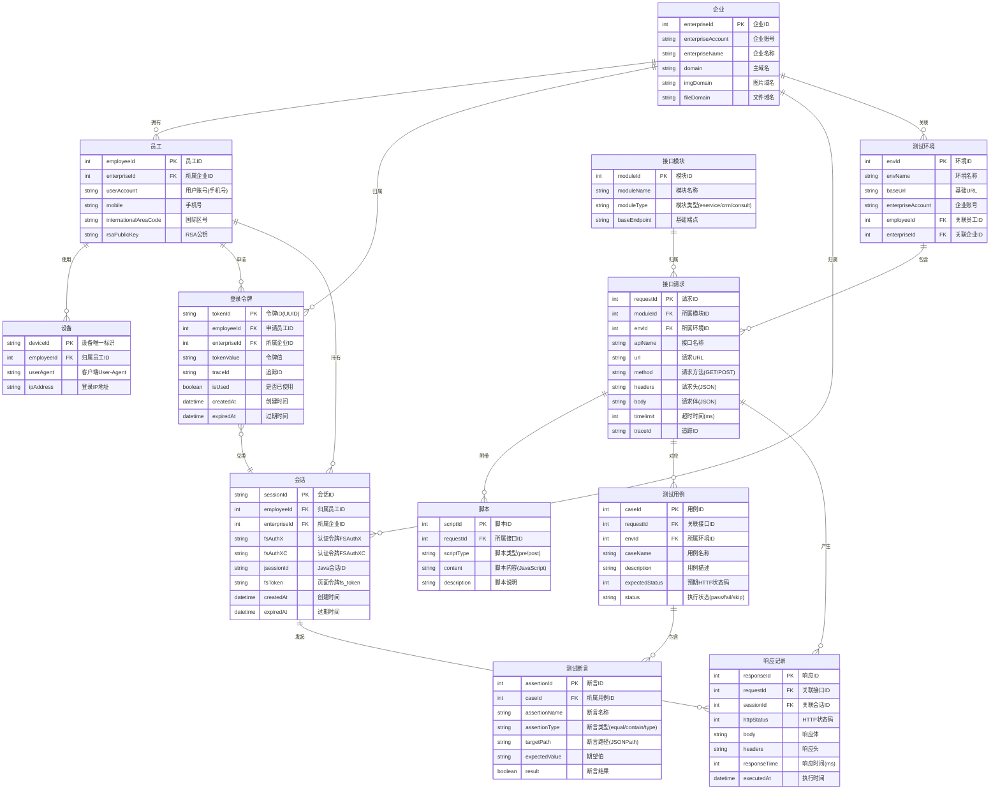

# 纷享销客自动化测试系统 ER 图

**系统名称**: 纷享销客自动化测试平台  
**文档版本**: v1.0  
**创建日期**: 2025-11-14  
**说明**: 本 ER 图基于 Eolink 自动化测试接口文档绘制，采用 Crow's Foot 符号规范，适用于论文引用。

---

## 实体关系图（Entity-Relationship Diagram）



---

## 实体说明

### 核心业务实体

| 实体名称 | 说明 |
|---------|------|
| 企业 | 纷享销客租户企业，是系统的顶级组织单元 |
| 员工 | 企业内的用户账号，通过手机号标识 |
| 设备 | 员工登录时使用的客户端设备信息 |
| 登录令牌 | 两步登录流程中的临时凭证（LoginToken），由接口1生成、接口2消费 |
| 会话 | 登录成功后的持久化会话，携带 Cookie 信息供后续接口使用 |

### 测试管理实体

| 实体名称 | 说明 |
|---------|------|
| 测试环境 | Eolink 中配置的环境变量集合（开发/测试/生产） |
| 接口模块 | 接口的分组，包括服务通(eservice)、CRM 对象接口、线上客服(consult)等 |
| 接口请求 | 单个 API 接口定义，包含 URL、请求方法、请求体等信息 |
| 脚本 | 挂载在接口上的前置/后置 JavaScript 脚本 |
| 测试用例 | 针对接口的完整测试场景，含预期状态码 |
| 测试断言 | 测试用例中的具体断言条件，验证响应数据的正确性 |
| 响应记录 | 接口执行后的实际响应数据及执行时间 |

---

## 关键业务流程（登录流程）

```
员工 ──发起──▶ 设备验证
                  │
                  ▼
          接口1：获取登录令牌
          (EnterpriseAccountCloudLogin)
                  │
                  ▼
            登录令牌(临时)
                  │
                  ▼
          接口2：令牌换会话
          (LoginByToken)
                  │
                  ▼
           会话(Cookie持久化)
                  │
                  ▼
          业务接口调用（携带Cookie）
```

---

## 注意事项

1. **登录令牌（LoginToken）** 为一次性临时凭证，使用后即失效，关系为 `1:1` 兑换一个会话。
2. **会话（Session）** 中的 `FSAuthX`、`FSAuthXC`、`JSESSIONID`、`fs_token` 四个 Cookie 字段为后续所有业务接口调用的必要认证信息。
3. **员工** 与 **企业** 之间为多对一关系，一个企业账号下可有多名员工。
4. **接口模块** 按业务功能划分，包括服务通（`/eservice`）、CRM 对象（`/API/v1/object`）、线上客服（`/online/consult`）三大模块。
